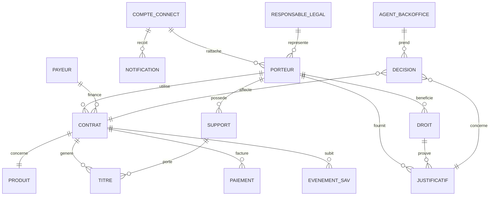

# SCHÉMA MÉTIER GLOBAL — PLATEFORME COMUTITRES / ÎLE-DE-FRANCE MOBILITÉS

> Objectif : **cartographie métier complète** : parcours utilisateur, règles produit, modèle de données, cycle de vie, droits, justificatifs, paiements, SAV, back-office, API, IA, conformité et pilotage.
>
> Dernière mise à jour : 2026-06-16.

---

## 0. Intention générale

La plateforme ne doit pas seulement numériser un formulaire papier. Elle doit devenir un **orchestrateur de vie transport** capable de suivre un porteur, son payeur, ses contrats, ses supports, ses droits, ses justificatifs et ses événements SAV dans la durée.

Le schéma cible repose sur 7 principes structurants :

1. **Utilisateur au centre** : l'utilisateur ne doit pas connaître à l'avance le nom exact du forfait.
2. **Distinction stricte des rôles** : porteur, payeur et responsable légal sont différents même s'ils peuvent parfois être la même personne.
3. **Distinction stricte des objets** : contrat, titre, support et droit ne doivent jamais être confondus.
4. **Cycle de vie continu** : Junior → Scolaire → Étudiant → Adulte → Senior, avec droits TST / Améthyste en parallèle selon situation.
5. **Validation asynchrone maîtrisée** : justificatifs, photos et droits peuvent être en attente sans perdre la lisibilité du dossier.
6. **Back-office natif** : chaque action front doit générer un statut, une trace, une file ou une action exploitable par les agents.
7. **Sobriété, conformité et anti-fraude** : collecter le minimum, expliquer la finalité, tracer les décisions, éviter les décisions automatisées sensibles sans recours humain.

---

## 1. Vision macro du système

```text
══════════════════════════════════════════════════════════════════════════════
                       PLATEFORME COMUTITRES / IDFM
                  Parcours client + règles + back-office
══════════════════════════════════════════════════════════════════════════════

                            ┌───────────────────────┐
                            │  Usager / Organisation │
                            └───────────┬───────────┘
                                        │
                                        ▼
                        ┌─────────────────────────────┐
                        │  Compte IDFM Connect        │
                        │  ou espace invité encadré   │
                        └───────────┬─────────────────┘
                                    │
                 ┌──────────────────┼───────────────────┐
                 ▼                  ▼                   ▼
          ┌─────────────┐    ┌─────────────┐     ┌─────────────┐
          │ Particulier │    │ Famille     │     │ Organisation│
          └──────┬──────┘    └──────┬──────┘     └──────┬──────┘
                 │                  │                   │
                 ▼                  ▼                   ▼
        Achat pour soi       Parent / foyer      Employeur / asso /
        ou gestion SAV       enfants rattachés   collectivité
                 │                  │                   │
                 └──────────┬───────┴───────────┬──────┘
                            ▼                   ▼
                 ┌──────────────────┐   ┌──────────────────┐
                 │ Moteur d'orientation│ │ Moteurs métier   │
                 │ meilleur forfait   │ │ règles / statuts │
                 └─────────┬──────────┘ └─────────┬────────┘
                           │                      │
                           ▼                      ▼
                ┌──────────────────────┐  ┌──────────────────────┐
                │ Tunnel souscription  │  │ Back-office agents   │
                │ renouvellement / SAV │  │ pilotage / contrôle  │
                └─────────┬────────────┘  └─────────┬────────────┘
                          │                         │
                          ▼                         ▼
           ┌─────────────────────────────┐  ┌────────────────────────────┐
           │ Contrat / Droit / Support   │  │ Historique / audit / RGPD  │
           │ Paiement / Justificatifs    │  │ relances / reporting       │
           └─────────────────────────────┘  └────────────────────────────┘
```

---

## 2. Sources de vérité intégrées dans ce schéma

| Source | Rôle dans le schéma enrichi |
|---|---|
| `notions_metier_structurantes_comutitres.md` | Définitions : porteur, payeur, responsable légal, compte Connect, contrat, support, titre, droit, justificatif, incomplétude, renouvellement, SAV, paiement, API, CGVU, RGPD, IA Act. |
| `cycle_vie_titres_transport.md` | Frise de vie du porteur, transitions d'âge, renouvellements, TST, Améthyste, expiration support, suspension, changement de payeur, recouvrement. |
| `analyse_cgvu_idfm_regles_metier.md` | Règles issues des CGVU : paiement, impayés, supports, photo, fraude, cohabitation, produit par produit, points juridiques et comptables à valider. |
| `faq_idfm_questions_reponses.md` | Formulations pédagogiques et aide contextuelle pour les situations fréquentes : connexion, perte/vol, oubli, chargement, impayés, remboursements, téléphone. |
| `perimetre_fonctionnel_hackathon_comutitres.md` | Périmètre MVP : orientation, souscription, justificatifs, TST, SAV, paiement, back-office, API, IA, RGPD, mobile-first. |
| `Objectif Principal & Vision.txt` | Vision produit : sortir du papier numérisé, personnalisation, accessibilité, anti-fraude, hybridation IA/humain, saisonnalité, B2B employeur. |

---

## 3. Modèle conceptuel : acteurs, objets et responsabilités

### 3.1 Acteurs humains et systèmes

| Acteur | Définition courte | Responsabilités métier |
|---|---|---|
| **Utilisateur connecté** | Personne qui utilise la plateforme. | Se connecter, suivre dossiers, recevoir notifications, effectuer actions autorisées. |
| **Porteur** | Personne qui utilise le titre ou le support dans le réseau. | Fournir identité, photo, droits, justificatifs, respecter usage nominatif et validation. |
| **Payeur** | Personne ou organisation responsable du paiement. | Accepter clauses financières, signer mandat, payer, régulariser impayés. |
| **Responsable légal** | Représentant d'un mineur ou majeur protégé. | Autoriser, signer, recevoir certaines communications, gérer le dossier du mineur. |
| **Organisation** | Employeur, association, collectivité ou tiers financeur. | Gérer bénéficiaires, payer en masse, consulter factures, administrer droits internes. |
| **Agent back-office** | Agent Comutitres. | Contrôler, valider, refuser, relancer, débloquer, tracer, traiter impayés et SAV. |
| **Système automatisé** | API, moteur de règles, IA d'assistance. | Pré-remplir, vérifier, scorer, recommander, relancer, pré-qualifier sans décision sensible autonome. |

### 3.2 Objets métier principaux



### 3.3 Règle cardinale

```text
Ne jamais modéliser un “utilisateur” unique qui ferait tout.

Contrat
├── Porteur                    = voyageur réel
├── Payeur                     = responsable financier
├── Responsable légal          = si mineur / représenté
├── Produit                    = Navigo Annuel, imagine R, TST, etc.
├── Titre                      = droit de voyager effectivement utilisable
├── Support                    = passe, téléphone, montre
├── Droit                      = réduction / gratuité / profil éligible
├── Justificatifs              = preuves ou données vérifiées
├── CGVU acceptées             = version, date, canal, acteur signataire
├── Paiement                   = moyen, mandat, échéances, impayés
└── Statut                     = état opérationnel du dossier / contrat
```

---

## 4. Distinction fondamentale : contrat, titre, support, droit

```text
Contrat = relation commerciale, juridique et administrative.
Titre   = droit de transport utilisable.
Support = objet physique ou numérique qui porte le titre.
Droit   = condition d'éligibilité à un tarif, une réduction ou une gratuité.
```

### Exemple

Un étudiant boursier peut avoir :

```text
Porteur
├── Profil : étudiant
├── Droit : bourse validée ou en attente
├── Contrat : imagine R Étudiant
├── Titre : forfait imagine R chargé
├── Support : passe imagine R physique
└── Payeur : parent ou lui-même selon situation
```

Si le support est perdu, le contrat ne disparaît pas. Le parcours doit remplacer le support et restaurer les titres ou droits selon les règles applicables.

---

## 5. Cycle de vie du porteur

```text
4 ans        11 ans        15 ans        +16 ans              62 ans
 |             |             |             |                    |
 |             |             |             |                    |
Identité  →  Scolaire  →  Compte     →  Autonomie       →  Senior
Junior       proposée      Connect       paiement           proposé
 |             |             |             |                    |
 └─────────────┴─────────────┴─────────────┴────────────────────┐
                                                                │
                         TST / Améthyste / droits sociaux selon situation
```

### Jalons métier

| Jalon | Événement | Impact produit |
|---:|---|---|
| ~4 ans | Enregistrement d'identité possible. | Créer fiche porteur, rattacher responsable légal et payeur. |
| Junior | Premier titre jeune. | Paiement par parent/responsable, renouvellement 12 mois. |
| ~11 ans | Proposition de bascule Scolaire. | Notification proactive, choix bascule ou suspension. |
| Scolaire | Justificatif scolaire, bourse possible. | Validation asynchrone, relances, statut d'incomplétude. |
| ~15 ans | Proposition de compte Connect porteur. | Préparer autonomie et continuité historique. |
| +16 ans | Le porteur peut devenir payeur selon règles internes à valider. | Changement de payeur, signature CGVU, mandat. |
| Étudiant | Statut post-secondaire. | Vérifier âge au 1er septembre, résidence, établissement, formation. |
| Adulte | Navigo Annuel / Liberté+ / titres courts. | Gestion paiement, support, renouvellement, impayés. |
| ~62 ans | Proposition Senior. | Notification, acceptation, recalcul tarifaire. |
| Tout âge | TST / Améthyste selon droits. | Vérification droits, renouvellement, fin de droit, retour plein tarif. |
| Tous les 10 ans environ | Expiration support physique. | Alerte, remplacement, maintien contrat/titres. |

### Point d'arbitrage mineurs

Le brief indique qu'aucun paiement n'est possible avant 16 ans. Certaines règles produit, notamment Navigo Liberté+ sur téléphone, mentionnent une possibilité à partir de 15 ans dans des conditions précises. Le schéma cible doit donc intégrer une règle de sécurité par défaut :

```yaml
minor_payment_policy:
  default_rule: no_direct_payment_before_16
  exceptions:
    - product_specific_rule_to_validate_legal_and_business
  required_controls:
    - age_detection
    - legal_representative_flow
    - payer_cgvu_signature
    - payment_method_authorization
```

---

## 6. Parcours d'entrée unifié

```text
Utilisateur arrive
       │
       ▼
┌────────────────────────────────────────┐
│ 1. Connexion / création / reprise      │
│    - IDFM Connect                      │
│    - FranceConnect / identité numérique│
│    - compte existant                   │
│    - invitation payeur                 │
└───────────────────┬────────────────────┘
                    ▼
┌────────────────────────────────────────┐
│ 2. Détection du contexte               │
│    - je voyage moi-même                │
│    - je souscris pour mon enfant       │
│    - je paie pour quelqu'un            │
│    - je gère une organisation          │
│    - je fais un SAV                    │
│    - je renouvelle / régularise        │
└───────────────────┬────────────────────┘
                    ▼
┌────────────────────────────────────────┐
│ 3. Orientation intelligente            │
│    - profil                            │
│    - âge                               │
│    - résidence / activité IDF          │
│    - scolarité / études                │
│    - droits sociaux                    │
│    - usage fréquent / occasionnel      │
│    - support souhaité                  │
│    - payeur distinct                   │
└───────────────────┬────────────────────┘
                    ▼
┌────────────────────────────────────────┐
│ 4. Recommandation expliquée            │
│    - offre optimale                    │
│    - alternative économique            │
│    - alternative flexible              │
│    - raisons et pièces nécessaires     │
└───────────────────┬────────────────────┘
                    ▼
┌────────────────────────────────────────┐
│ 5. Tunnel adapté                       │
│    - souscription                      │
│    - renouvellement                    │
│    - droit temporaire                  │
│    - SAV                               │
│    - impayé                            │
└────────────────────────────────────────┘
```

---

## 7. Moteur d'orientation vers le bon forfait

### 7.1 Données d'entrée

| Catégorie | Données | Source possible | Principe RGPD |
|---|---|---|---|
| Identité | nom, prénom, date de naissance | IDFM Connect, FranceConnect, saisie | Nécessaire pour contrat/support nominatif. |
| Âge | calcul depuis date de naissance | compte / justificatif | Utilisé pour Junior, Scolaire, Étudiant, Senior, mineur. |
| Adresse | adresse, commune, département, région | API Adresse, API Geo | Vérifier résidence IDF ou département. |
| Scolarité | établissement, année scolaire, formation | justificatif, API mock | Limiter à ce qui justifie l'éligibilité. |
| Bourse | statut boursier, attestation | justificatif, API mock | Donnée sensible à minimiser et tracer. |
| Droits sociaux | CAF, MSA, RSA, France Travail, MDPH, etc. | API mock / justificatif | Finalité explicite, accès restreint. |
| Usage | fréquence, zones, support préféré | questionnaire | Ne pas collecter plus que nécessaire. |
| Paiement | payeur, mandat, moyen de paiement | PSP / SEPA / mock | Lier au payeur, pas au porteur. |
| Support | passe existant, téléphone, montre | SI support / application | Moteur de compatibilité obligatoire. |

### 7.2 Décision de recommandation

```text
Questionnaire court
   │
   ├── Âge < seuil mineur ? ────────────► Parcours responsable légal / payeur
   ├── Statut scolaire ? ───────────────► Imagine R Junior / Scolaire
   ├── Étudiant post-secondaire ? ──────► Imagine R Étudiant
   ├── Droits sociaux ? ────────────────► TST / réduction / gratuité
   ├── Département attribue droit ? ────► Améthyste
   ├── Usage quotidien ? ───────────────► Navigo Annuel / Senior si éligible
   ├── Usage occasionnel mais régulier ?► Liberté+ si support compatible
   └── Usage ponctuel ? ────────────────► Navigo Mois/Semaine/Jour ou tickets compatibles
```

### 7.3 Sortie attendue

Chaque recommandation doit afficher :

- le produit recommandé ;
- pourquoi il est recommandé ;
- le tarif ou la logique tarifaire si disponible ;
- les conditions à vérifier ;
- le support compatible ;
- les documents nécessaires ;
- les acteurs à faire intervenir ;
- le délai estimé ou le statut de validation ;
- les alternatives possibles ;
- le chemin d'aide ou de conseiller humain.

---

## 8. Produits couverts et règles structurantes

### 8.1 Matrice produit synthétique

| Produit | Porteur | Payeur distinct | Support | Paiement | Renouvellement | Points sensibles |
|---|---|---:|---|---|---|---|
| **Navigo Annuel** | adulte / salarié / usager régulier | Oui | Passe Navigo Annuel nominatif | Prélèvement ou comptant selon cas | Automatique selon conditions, sauf cas particuliers | suspension, reprise, résiliation, impayés, mois commencé dû. |
| **Navigo Annuel Senior** | senior éligible | Oui | Passe Navigo nominatif | Prélèvement ou comptant selon cas | Automatique selon conditions | proposition à l'âge cible, validation explicite, justificatifs éventuels. |
| **Imagine R Junior** | enfant mineur | Oui | Passe imagine R | Payeur majeur / représentant | Annuel | responsable légal, photo, scolarité/âge, paiement mineur impossible. |
| **Imagine R Scolaire** | scolaire / apprenti éligible | Oui | Passe imagine R | Payeur majeur / émancipé | Annuel | justificatif scolaire, bourse, relances, dossier incomplet. |
| **Imagine R Étudiant** | étudiant post-secondaire < 26 ans au 1er septembre | Oui | Passe imagine R | Selon contrat | Annuel | résidence IDF, formation initiale 350h, établissement éligible, pas contrat pro. |
| **Navigo Liberté+ sur passe** | titulaire avec passe personnalisé | Oui | Passe Navigo personnalisé uniquement | SEPA post-payé | Durée indéterminée | facturation a posteriori, impayé J+5/J+30, pas multi-validation. |
| **Navigo Liberté+ téléphone** | titulaire-payeur unique | Non | Téléphone compatible | SEPA post-payé | Durée indéterminée | app uniquement, support compatible, pas tarif réduit, sauvegarde/restauration. |
| **TST** | bénéficiaire droit social / ayant droit | Selon cas | Passe Navigo personnalisé | Selon titre associé | Spécifique, parfois 3 mois selon frise | droit à charger, supports interdits, fin de droit, retour plein tarif. |
| **Améthyste** | bénéficiaire attribué par département | Selon département | Passe Navigo nominatif | Selon département / règles locales | Selon département | droit attribué localement, chargement distinct, vérification documentaire. |
| **Navigo Mois/Semaine** | usager ponctuel ou complément | Généralement non structurant | Support compatible | Comptant | Achat période | vente calendrier, validation, remboursement conditionnel, oubli non remboursé. |

### 8.2 Règles produit en pseudo-YAML

```yaml
products:
  navigo_annuel:
    contract_duration: indefinite
    support: navigo_annuel_or_personalized_pass
    payer_can_differ: true
    suspension:
      allowed: true
      max_months: 12
      after_max: automatic_termination
    cancellation:
      current_month_due: true
    unpaid:
      can_block_new_subscription: true
      regularization_channels: [personal_space_card_payment, phone_card_payment, agency]

  imagine_r_scolaire_junior:
    support: navigo_imagine_r
    annual_renewal: true
    payer:
      must_be: adult_or_emancipated_minor
      can_differ_from_holder: true
      can_pay_multiple_contracts: true
    required_controls:
      - holder_age
      - legal_representative_if_minor
      - photo
      - school_status
    scholarship:
      proof_required: true
      late_proof_strategy: provisional_non_scholarship_price_until_validated
      async_validation: true
    proof_request:
      response_deadline_days: 30
    holder_under_15:
      collect_email: false_when_not_required
      communications_to: payer

  imagine_r_etudiant:
    eligible_if:
      - residence_idf
      - age_on_september_1_lt_26
      - initial_training_hours_min_350
      - institution_eligible
    excluded:
      - contrat_de_professionnalisation
    payer_can_differ: true
    renewal: annual

  navigo_liberte_plus_passe:
    billing: postpaid_monthly
    payment_method: sepa_direct_debit_only
    support:
      allowed: navigo_personnalise
      forbidden: [navigo_decouverte, navigo_imagine_r, navigo_annuel]
    payer:
      can_differ_from_holder: true
      must_be: adult_or_emancipated_minor
      can_pay_max_contracts: 10
    unpaid_process:
      notify: [email, sms]
      suspend_after_days: 5
      terminate_after_days: 30
    sav_allowed_if_unpaid: false
    validation:
      required_each_trip: true
      multiple_people_forbidden: true

  navigo_liberte_plus_phone:
    billing: postpaid_monthly
    support: compatible_phone_only
    subscription_channel: idfm_mobile_app_only
    holder_and_payer:
      must_be_same_person: true
      payer_can_differ: false
      min_age_to_validate: product_specific_legal_review
    reduced_fare:
      applicable: false
    cohabitation:
      all_zone_pass_priority_over_liberte_plus: true
      liberte_plus_priority_over_unit_titles: true
      unit_titles_after_subscription: forbidden
    unpaid_process:
      notify_channels: [email, push_notification, sms]
      suspend_after_days: 5
      terminate_after_days: 30
    device_lifecycle:
      restore_allowed: [android_to_android_compatible, ios_to_ios_compatible]
      backup_removes_titles_from_old_phone: true
      temporary_titles_refunded_after_loss_or_theft: false

  tst:
    products: [solidarite_gratuite, reduction_solidarite_75, reduction_50]
    support:
      required: navigo_personnalise
      forbidden: [navigo_decouverte, navigo_imagine_r, navigo_annuel]
    right_must_be_loaded_on_support: true
    max_active_right_per_person: 1
    renewal:
      specific_cycle: true
      may_be_automatic_if_rights_can_be_checked: true
      duration_depends_on_social_right: true
    end_of_right:
      notify_holder: true
      ask_return_to_full_fare_validation: true
      refusal_can_suspend_contract_and_debits: true
    fraud:
      suspend_right: true

  amethyste:
    attributed_by: departement_idf
    managed_by: comutitres_for_idfm
    support: navigo_personnalise
    loading_channels: [mobile_app, ticket_office, vending_machine]
    renewal: depends_on_departement
```

---

## 9. Tunnel de souscription cible

```text
1. Arrivée utilisateur
2. Connexion / création / reprise de compte
3. Choix du contexte : moi / enfant / tiers / organisation / SAV / impayé
4. Questionnaire d'orientation
5. Recommandation expliquée
6. Création ou rattachement du porteur
7. Vérification des prérequis produit
8. Choix ou création du support
9. Identification du payeur si différent
10. Responsable légal si mineur ou représenté
11. Collecte des justificatifs nécessaires
12. Contrôle photo si support nominatif
13. Acceptation CGVU produit + CGU support par les bons acteurs
14. Choix ou validation moyen de paiement
15. Récapitulatif pédagogique
16. Soumission du dossier
17. Statut clair côté utilisateur
18. File back-office si validation nécessaire
19. Acceptation, refus ou demande de complément
20. Activation contrat / titre / droit / support
21. Notifications et historique
```

### États visibles utilisateur

| État utilisateur | Message attendu | Action proposée |
|---|---|---|
| Brouillon | Votre demande n'est pas encore envoyée. | Reprendre. |
| À compléter | Une information manque. | Voir ce qui manque. |
| Justificatif reçu | Le document a bien été reçu. | Suivre le statut. |
| En vérification | Un agent ou un contrôle automatique vérifie le document. | Attendre / demander aide. |
| Complément demandé | Le document ne suffit pas ou une donnée est incohérente. | Déposer un complément. |
| Photo refusée | La photo ne respecte pas les critères. | Refaire la photo. |
| Payeur à valider | Le payeur doit signer ou configurer le paiement. | Renvoyer invitation. |
| Paiement à régulariser | Un paiement est en échec. | Régulariser maintenant. |
| Contrat actif | Le contrat est actif. | Voir titre/support. |
| Droit à charger | Le droit est accordé mais doit être chargé sur le support. | Charger le droit. |
| Support à renouveler | Le support arrive à expiration. | Commander/remplacer. |
| Suspendu | Le contrat ou le droit est suspendu. | Voir raison et solution. |
| Résilié | Le contrat est terminé. | Comprendre / souscrire à nouveau si autorisé. |

---

## 10. Parcours famille natif

```text
Parent / responsable légal
        │
        ▼
Compte IDFM Connect parent
        │
        ├── Fiche porteur enfant 1
        ├── Fiche porteur enfant 2
        └── Fiche porteur enfant N
        │
        ▼
Détection âge / scolarité / bourse / support
        │
        ▼
Produit recommandé : Junior / Scolaire / Étudiant
        │
        ▼
Payeur identifié
        │
        ├── parent = payeur
        ├── autre parent = payeur invité
        └── tiers = payeur invité / règles à valider
        │
        ▼
Justificatifs + photo + CGVU + paiement
        │
        ▼
Suivi multi-enfants + renouvellements + relances
```

### Règles spécifiques famille

- Afficher systématiquement qui est **porteur**, qui est **payeur**, qui est **responsable légal**.
- Ne pas demander l'e-mail d'un mineur si ce n'est pas nécessaire.
- Les notifications peuvent aller au payeur et/ou au responsable légal selon produit.
- Un payeur peut financer plusieurs contrats, mais les impayés doivent pouvoir bloquer de nouvelles prises en charge.
- Prévoir une migration progressive vers l'autonomie : proposition de compte Connect à 15 ans, changement de payeur après seuil validé.

---

## 11. Parcours organisation / employeur / association

Le schéma initial mentionnait déjà entreprise, association et collectivité. Le schéma enrichi les conserve comme extension structurée.

```text
Organisation
   │
   ├── Vérification SIREN / SIRET / référentiel public
   ├── Validation administrateur
   ├── Espace gestionnaire
   │    ├── salariés
   │    ├── adhérents
   │    ├── bénéficiaires
   │    └── ayants droit éventuels
   ├── Attribution / financement titres
   ├── Facturation organisation
   ├── Historique et exports
   └── Support back-office dédié
```

### Fonctions à prévoir

| Module | Fonctions |
|---|---|
| Identification organisation | SIREN/SIRET, nom légal, adresse, représentant, justificatifs éventuels. |
| Gestion bénéficiaires | Import, invitation, rattachement porteur, droits internes. |
| Paiement | facture groupée, paiement organisation, régularisation, historique. |
| Administration | rôles gestionnaires, délégation, audit des actions. |
| Conformité | minimisation, finalité, séparation données employeur/salarié. |
| Extension B2B | suivi titres salariés, simplification remboursement employeur, reporting. |

---

## 12. Gestion des justificatifs et documents

### 12.1 Typologie documentaire

| Justificatif | Produit / contexte | Validation possible | Points sensibles |
|---|---|---|---|
| Photo | supports nominatifs | IA qualité + agent si rejet | obligatoire, lisibilité, neutralité, refus explicite. |
| Pièce d'identité | porteur / mineur / remplacement | contrôle automatisé + humain | minimisation, durée conservation, sécurité. |
| Certificat de scolarité | Scolaire / Étudiant | API mock ou document | année scolaire, établissement, formation. |
| Attestation de bourse | imagine R boursier | document / API mock | arrive tardivement, tarif provisoire. |
| Justificatif domicile | résidence IDF / département | API Adresse + document | éviter fausses adresses, retours courrier. |
| Droit social CAF/MSA/RSA/etc. | TST | API mock / justificatif | donnée sensible, accès restreint. |
| Handicap / MDPH | TST / Améthyste | API mock / justificatif | donnée sensible, contrôle humain. |
| Mandat SEPA / IBAN | prélèvement | PSP / contrôle bancaire | lié au payeur. |
| Procuration / représentation | mineur, majeur protégé, agence | document | articulation responsable légal/payeur. |

### 12.2 Workflow documentaire

```text
Upload document
     │
     ▼
Contrôle technique
- format
- taille
- lisibilité
- absence de flou évident
     │
     ▼
Pré-qualification IA optionnelle
- type de document
- cohérence nom/prénom
- date / année scolaire
- établissement
- adresse
- expiration
- score de confiance
     │
     ├── Score haut + règle simple ───► acceptation assistée ou file allégée
     ├── Score moyen ─────────────────► file agent standard
     └── Score bas / incohérence ─────► demande de correction ou contrôle renforcé
     │
     ▼
Décision traçable
- accepté
- refusé avec motif
- complément demandé
- expiré
- suspect / contrôle renforcé
```

### 12.3 Garde-fous IA documentaire

```yaml
document_ai:
  purpose: assistance_and_prequalification
  user_can_refuse_ai: true
  human_review_for_sensitive_cases: true
  no_sensitive_final_decision_without_human_review: true
  explain_to_user:
    - why_document_needed
    - what_ai_checks
    - how_to_get_human_help
  audit:
    - score
    - model_version_or_rule_version
    - detected_fields
    - agent_decision
    - refusal_reason
  anti_bias:
    - no_unnecessary_civility_prediction
    - no_auto_gendering
    - neutral_messages
```

---

## 13. Paiement, mandat, impayés et recouvrement

### 13.1 Paiement lié au payeur

```text
Payeur
├── Identité
├── Coordonnées
├── Moyen de paiement
├── Mandat / autorisation
├── CGVU financières acceptées
├── Échéancier
├── Historique de paiements
├── Impayés
└── Statut de recouvrement
```

### 13.2 Moyens de paiement à modéliser

| Moyen | Usage cible | Points d'attention |
|---|---|---|
| Carte bancaire | achat comptant, régularisation impayé | paiement immédiat, PSP, preuve. |
| Prélèvement SEPA | abonnements, Liberté+ | mandat, signature, rejet bancaire, relances. |
| Comptant | certains produits / renouvellements | mois commencé dû, preuve comptable. |
| Chèque / courrier | cas résiduels ou non-numériques | parcours dégradé, délais, incomplétude. |
| Tiers payant / organisation | B2B, association, collectivité | facturation groupée, rôle gestionnaire. |
| Crypto / USDC | idée hors MVP | non couverte par les règles métier lues ; à isoler comme expérimentation non prioritaire et à valider juridiquement/comptablement. |

### 13.3 Chaîne impayé générique

```text
Paiement attendu
    │
    ▼
Échec / rejet
    │
    ▼
Notification payeur
+ notification porteur si nécessaire
    │
    ▼
Délai de régularisation produit
    │
    ├── Régularisé ─────► reprise / maintien / historique
    │
    └── Non régularisé ─► suspension / blocage SAV / blocage nouvelle souscription
                            │
                            ▼
                    Recouvrement / résiliation selon produit
```

### 13.4 Statuts paiement

```text
paiement_a_jour
paiement_en_attente
paiement_echoue
impaye_detecte
relance_envoyee
regularisation_en_attente
regularise
contrat_suspendu_pour_impaye
recouvrement_en_cours
transfert_tresor_public_si_applicable
blocage_nouvelle_souscription
```

---

## 14. CGVU, signatures et traçabilité juridique

### 14.1 Règle d'acceptation

Chaque souscription ou achat doit faire accepter :

- les CGVU du produit ;
- les CGU du support ;
- les clauses financières au payeur ;
- les clauses d'usage au porteur ou représentant légal si nécessaire ;
- les consentements facultatifs séparément des acceptations contractuelles.

### 14.2 Qui signe quoi ?

| Situation | Porteur | Payeur | Responsable légal | Action requise |
|---|---|---|---|---|
| Adulte paie pour soi | Oui | Oui, même personne | Non | Acceptation produit + support + paiement. |
| Parent paie enfant mineur | Enfant porteur | Parent payeur | Parent ou autre responsable | Responsable/payeur signe, enfant peut être informé selon âge. |
| Payeur différent adulte | Adulte porteur | Tiers payeur | Non | Porteur accepte usage ; payeur accepte paiement. |
| Organisation finance | Salarié/bénéficiaire | Organisation | Non sauf mineur | Mandat/règles B2B + information porteur. |
| Liberté+ téléphone | Titulaire-payeur unique | Même personne | Cas mineur à valider | Pas de payeur distinct. |

### 14.3 Trace à conserver

```yaml
cgvu_acceptance:
  product_cgvu_version: required
  support_cgu_version: required
  accepted_by_actor_id: required
  actor_role: holder_or_payer_or_legal_representative
  timestamp: required
  channel: web_or_mobile_or_agent
  ip_or_device: if_legally_allowed
  consent_separation:
    commercial_prospection: optional
    travel_data_retention: optional_when_applicable
  backoffice_visibility: restricted_but_auditable
```

---

## 15. Support, cohabitation et mobilité téléphone / montre

### 15.1 Types de supports

| Support | Usage | Règles majeures |
|---|---|---|
| Passe Navigo personnalisé | support nominatif principal | photo, non cessible, un seul actif par personne selon règles, remplacement perte/vol. |
| Passe imagine R | support jeune | personnel, photo, compatible imagine R, règles de remplacement. |
| Passe Navigo Annuel | abonnement annuel | personnel, non cessible, perte/vol suivis. |
| Téléphone iOS/Android | achat, chargement, validation mobile | compatibilité OS/NFC, élément sécurisé, règles de sauvegarde/restauration. |
| Montre connectée | extension mobile selon compatibilité | même logique de support numérique, cohabitation à contrôler. |
| Navigo Découverte | certains titres | support non compatible avec certains droits comme TST ou Liberté+ selon règles. |

### 15.2 Moteur de compatibilité support / titre

```text
Produit choisi
   │
   ▼
Support existant ?
   │
   ├── Oui ──► vérifier type, statut, expiration, titres déjà présents
   │
   └── Non ──► proposer création support compatible
   │
   ▼
Compatibilité produit / support
   │
   ├── compatible ──────► poursuivre
   ├── incompatible ────► expliquer pourquoi + proposer support correct
   └── cohabitation ────► expliquer priorité de validation / restrictions
```

### 15.3 Règles de cohabitation à intégrer

- Ne jamais vendre un titre impossible à charger.
- Afficher clairement les incompatibilités avant paiement.
- Prioriser les forfaits toutes zones avant Liberté+ lorsque les règles le prévoient.
- Expliquer que certains titres unitaires peuvent devenir inutilisables après souscription Liberté+ téléphone.
- Distinguer perte du passe physique et perte du téléphone.
- Prévoir le changement de téléphone avec sauvegarde/restauration.
- Expliquer que le pass physique n'est pas une simple copie transférable vers téléphone ou montre.

---

## 16. SAV intégré au cycle de vie

Le SAV ne doit pas être un module séparé : il est une branche du cycle de vie du contrat, du titre, du droit et du support.

### 16.1 Entrées SAV principales

```text
J'ai un problème
   │
   ├── J'ai perdu mon passe
   ├── On m'a volé mon passe
   ├── Mon passe est abîmé
   ├── Mon passe ne fonctionne plus
   ├── J'ai oublié mon passe
   ├── Mon support expire
   ├── J'ai changé de téléphone
   ├── J'ai perdu mon téléphone
   ├── Je n'arrive pas à charger mon titre
   ├── J'ai un impayé
   ├── Je veux changer de payeur
   ├── Je veux suspendre / reprendre
   ├── Je veux résilier
   ├── Mon justificatif est refusé
   └── Je veux comprendre mon renouvellement
```

### 16.2 Parcours perte / vol / support HS

```text
Déclarer l'événement
     │
     ▼
Identifier le support
     │
     ▼
Lister contrats / titres / droits associés
     │
     ▼
Afficher conséquences
- opposition
- frais éventuels
- délais
- titres d'attente non remboursés si applicable
- besoin d'agence ou identité si nécessaire
     │
     ▼
Choisir mode de remplacement
     │
     ▼
Suivi nouveau support
     │
     ▼
Rechargement / restauration droits et titres
```

### 16.3 Parcours oubli du support

Message cible :

> Vous devez acheter un titre valide pour voyager. L'oubli du passe ne dispense pas de validation et le titre acheté en dépannage n'est généralement pas remboursé.

### 16.4 Parcours changement de payeur

```text
Demande changement payeur
   │
   ├── vérifier contrat actif
   ├── vérifier absence blocage impayé selon produit
   ├── inviter nouveau payeur
   ├── collecter moyen de paiement / mandat
   ├── faire accepter CGVU financières
   ├── notifier ancien payeur si nécessaire
   └── historiser date d'effet
```

---

## 17. TST et droits temporaires

### 17.1 Distinction importante

```text
Droit accordé ≠ droit chargé ≠ titre acheté ≠ contrat actif
```

Un droit TST peut être accepté administrativement mais encore non chargé sur le support. Le parcours doit rendre cette différence explicite.

### 17.2 Cycle TST

```text
Demande TST
   │
   ▼
Vérification éligibilité sociale
   │
   ├── API disponible ─────► résultat immédiat ou différé
   └── Pas d'API ──────────► justificatif + back-office
   │
   ▼
Droit accordé / refusé / complément demandé
   │
   ▼
Chargement du droit sur passe compatible
   │
   ▼
Utilisation réduction / gratuité
   │
   ▼
Avant fin de droit : notification proactive
   │
   ├── droit renouvelé ─────► maintien + mensualités mises à jour
   └── droit expiré/refusé ─► retour plein tarif à valider ou suspension
```

### 17.3 Statuts TST

```text
droits_tst_a_verifier
droits_tst_en_attente_justificatif
droits_tst_valides
droits_tst_refuses
droits_tst_a_charger
droits_tst_expires
retour_plein_tarif_a_valider
retour_plein_tarif_accepte
retour_plein_tarif_refuse
contrat_suspendu_suite_fin_droit
```

---

## 18. Renouvellements et transitions

### 18.1 Moteur de renouvellement

```text
Tous les jours / toutes les semaines
   │
   ▼
Chercher échéances à venir
   │
   ├── contrat à renouveler
   ├── droit à renouveler
   ├── justificatif à redéposer
   ├── support à renouveler
   ├── payeur à confirmer
   └── profil à basculer
   │
   ▼
Calculer action
   │
   ├── renouvellement automatique
   ├── renouvellement avec validation utilisateur
   ├── demande justificatif
   ├── notification préventive
   ├── file back-office
   └── suspension si absence réponse / refus selon règle
```

### 18.2 Transitions à anticiper

| Transition | Déclencheur | Action plateforme |
|---|---|---|
| Junior → Scolaire | âge / année scolaire | proposer bascule, expliquer tarif, demander accord. |
| Scolaire → Étudiant | fin scolarité / inscription supérieure | demander justificatif étudiant, recommander imagine R étudiant. |
| Étudiant → Adulte | âge, fin statut, fin droit | proposer Navigo Annuel / Liberté+ / titre adapté. |
| Adulte → Senior | âge cible | proposer tarif senior, demander validation. |
| Droit réduit → plein tarif | fin droit TST/bourse/social | notifier, expliquer impact, demander choix. |
| Support actif → support expirant | date émission + durée | commander remplacement sans rupture. |

---

## 19. Back-office Comutitres cible

### 19.1 Rôle du back-office

Le back-office n'est pas seulement un outil de validation. Il doit devenir un **poste de pilotage opérationnel** : files de dossiers, statuts, justificatifs, paiements, impayés, SAV, API, IA, relances, fraude et reporting.

### 19.2 Modules back-office

| Module | Fonctionnalités |
|---|---|
| Tableau de bord | volumes, files, urgences, pics saisonniers, SLA. |
| Dossiers | recherche porteur, payeur, contrat, support, droit. |
| Justificatifs | prévisualisation, contrôle, refus motivé, complément. |
| Photos | contrôle qualité, validation, refus pédagogique. |
| Paiements | échéances, impayés, régularisation, recouvrement. |
| Renouvellements | contrats/droits/supports à renouveler, relances. |
| TST / Améthyste | files droits sociaux, fin de droit, département, ayants droit. |
| SAV | perte, vol, HS, oubli, téléphone, changement support. |
| Fraude | incohérences, contrôle renforcé, historique, mesures. |
| API | supervision mocks/API réelles, erreurs, fallback manuel. |
| IA | scores, recommandations, décisions assistées, audit. |
| Reporting | taux incomplétude, délais, motifs refus, appels évités. |

### 19.3 Files de travail agents

```text
file_nouvelles_demandes
file_dossiers_incomplets
file_justificatifs_a_verifier
file_photos_a_verifier
file_controles_renforces
file_paiements_echoues
file_impayes_a_relancer
file_recouvrement
file_changements_payeur
file_tst_fin_de_droit
file_renouvellements_a_preparer
file_supports_a_remplacer
file_sav_perte_vol_hs
file_reclamations_facture
file_recours_refus
```

### 19.4 Statuts back-office transverses

```text
nouvelle_demande
dossier_en_brouillon
dossier_a_completer
dossier_incomplet
identite_a_verifier
piece_identite_enregistree
photo_en_attente
photo_en_verification
photo_validee
photo_refusee
justificatif_en_attente
justificatif_recu
justificatif_en_verification
justificatif_accepte
justificatif_refuse
complement_demande
controle_renforce
cgvu_porteur_a_valider
cgvu_payeur_a_valider
mandat_sepa_a_signer
paiement_en_attente
paiement_echoue
impaye_detecte
regularisation_en_attente
recouvrement_en_cours
contrat_actif
contrat_suspendu
contrat_resilie
contrat_expire
contrat_a_renouveler
renouvellement_automatique
renouvellement_refuse
droit_a_verifier
droit_valide
droit_refuse
droit_a_renouveler
transition_profil_a_valider
bascule_scolaire_proposee
bascule_senior_proposee
support_a_renouveler
support_expire
sav_en_cours
sav_resolu
```

---

## 20. API, mocks et automatisation

### 20.1 Sources API à prévoir

| Besoin | API / source | Usage |
|---|---|---|
| Identité | FranceConnect / identité numérique | pré-remplissage, lutte usurpation. |
| Adresse | API Adresse | autocomplétion, adresse réelle, retours courrier. |
| Géographie | API Geo / commune / département | résidence IDF, département Améthyste, zone. |
| Entreprise | API Sirene | employeur, organisation, SIREN/SIRET. |
| Scolarité | référentiel établissements / mock Éducation | établissement, année, formation. |
| Bourse | source éducation/département / mock | boursier, notification provisoire/définitive. |
| Droits sociaux | CAF, MSA, France Travail, Assurance Maladie, MDPH / mocks | TST, gratuité, réduction. |
| Fiscalité/revenus | DGFiP / mock si habilité | quotient, aides, tarification éventuelle. |
| Paiement | PSP, SEPA, Onex/Omex ou concurrent | CB, prélèvement, mandat, impayés. |
| Support | SI billettique | support existant, expiration, titres chargés. |
| Contrat | SI Comutitres | contrat actif, statut, renouvellement. |
| Recouvrement | SI financier / Trésor Public si applicable | dette, blocage, régularisation. |

### 20.2 Stratégie mock hackathon

```yaml
api_mocks:
  identity:
    scenarios: [match, mismatch, minor, duplicate_account]
  address:
    scenarios: [valid_idf, valid_non_idf, unknown, ambiguous]
  schooling:
    scenarios: [student_valid, school_valid, expired_year, institution_unknown]
  scholarship:
    scenarios: [confirmed, provisional, missing, rejected]
  social_rights:
    scenarios: [tst_eligible, tst_expiring, tst_expired, not_eligible]
  payment:
    scenarios: [card_success, card_failure, sepa_signed, sepa_rejected, debt_active]
  support:
    scenarios: [compatible, incompatible, expired, lost, phone_compatible, phone_incompatible]
```

---

## 21. IA d'assistance : utilisateur et back-office

### 21.1 Usages côté utilisateur

- Orientation vers le bon forfait.
- Explication d'un statut de dossier.
- Aide au dépôt de justificatif.
- Détection d'incomplétude avant envoi.
- FAQ contextuelle.
- Traduction ou reformulation en langage simple.
- Rappel proactif des échéances.
- Simulation de parcours de vie : “que va-t-il se passer l'année prochaine ?”.

### 21.2 Usages côté back-office

- Résumé de dossier.
- Détection d'anomalies.
- Priorisation de dossiers urgents.
- Suggestion de motif de refus à valider par agent.
- Pré-classement des documents.
- Détection de pics saisonniers.
- Aide à la réponse FAQ.

### 21.3 Limites non négociables

```yaml
ai_governance:
  decision_sensitive_without_human: forbidden
  user_opt_out: required
  explainability: required
  no_unnecessary_gender_or_civility: true
  human_contact_available: true
  audit_scores_and_suggestions: true
  data_minimization: true
  special_category_data_controls: strict
```

---

## 22. RGPD, CNIL et sobriété des données

### 22.1 Finalités à distinguer

```yaml
privacy_purposes:
  account_management: true
  contract_management: true
  eligibility_check: true
  support_management: true
  payment_and_billing: true
  sav_and_claims: true
  fraud_prevention: true
  legal_traceability: true
  statistics: aggregated_or_minimized
  institutional_communication: controlled
  commercial_prospection: optional_consent_only
```

### 22.2 Règles de sobriété

- Ne demander une donnée que si elle sert une finalité claire.
- Supprimer les civilités si aucune règle métier ou juridique ne les impose.
- Séparer acceptation CGVU et consentement marketing.
- Limiter la visibilité back-office des données sensibles.
- Tracer les accès agents aux justificatifs et données de paiement.
- Prévoir durées de conservation par type de donnée.
- Donner accès aux droits : information, accès, rectification, opposition, effacement quand possible, limitation, portabilité selon cas.
- Informer les mineurs et responsables légaux de manière compréhensible.

---

## 23. UX, accessibilité et mobile-first

### 23.1 Principes UX

- Un écran = une décision ou une information claire.
- Toujours expliquer “pourquoi cette information est demandée”.
- Afficher le statut exact et l'action suivante.
- Réduire le jargon : éviter “incomplétude” côté client, préférer “il manque un document”.
- Prévoir les personnes non francophones avec pictogrammes, exemples et traduction.
- Ne jamais bloquer sans expliquer le motif et la voie de résolution.
- Proposer un conseiller humain à tout moment sur les cas sensibles.

### 23.2 UX mobile

- Scan document depuis téléphone.
- Contrôle immédiat qualité photo/document.
- Sauvegarde automatique du brouillon.
- Reprise du dossier via lien sécurisé.
- Notifications push/SMS/e-mail selon consentement et produit.
- Paiement mobile compatible.
- Chargement ou vérification support depuis app quand possible.

### 23.3 Exemples de microcopies issues de la FAQ

| Situation | Message court |
|---|---|
| Oubli du passe | “Vous devez acheter un titre valide pour voyager. L'oubli du passe n'est pas un motif de remboursement automatique.” |
| Photo refusée | “Votre photo ne permet pas d'identifier clairement le porteur. Reprenez une photo nette, récente, sans filtre.” |
| Payeur manquant | “La personne qui paie doit encore valider le paiement et les conditions financières.” |
| Justificatif bourse tardif | “Vous pouvez continuer votre demande, mais le tarif boursier ne pourra être confirmé qu'après validation du justificatif.” |
| Droit TST accordé mais non chargé | “Votre droit est accordé. Il doit maintenant être chargé sur votre passe pour être utilisable.” |
| Impayé | “Un paiement est en attente de régularisation. Certaines actions sont bloquées jusqu'au règlement.” |
| Support incompatible | “Ce titre ne peut pas être chargé sur ce support. Nous vous proposons un support compatible.” |

---

## 24. Saisonnalité et réduction de charge support

### 24.1 Pics à anticiper

| Période | Public | Risque | Réponse produit |
|---|---|---|---|
| Juin - octobre | Imagine R | flux continu | campagnes de renouvellement progressives, statuts clairs. |
| Fin août / début septembre | Scolaires | pic critique | relances anticipées, pré-validation documents, files prioritaires. |
| Octobre | Étudiants | second pic | parcours étudiant boursier, dépôt tardif, FAQ contextuelle. |

### 24.2 Objectifs anti-appels

- Statut de dossier explicite.
- Raison de blocage visible.
- Date attendue ou prochaine étape.
- Relances intelligentes.
- FAQ contextualisée par produit et statut.
- Parcours de correction autonome.
- Aide conseiller uniquement quand nécessaire.

---

## 25. Parcours MVP recommandé pour hackathon

### 25.1 Socle MVP

```text
1. L'utilisateur répond à 6-8 questions simples.
2. Le système recommande un forfait.
3. L'utilisateur crée / rattache un compte.
4. Le système crée une fiche porteur.
5. Le système identifie si payeur distinct ou responsable légal nécessaire.
6. L'utilisateur dépose photo / justificatif.
7. Un mock API vérifie adresse, scolarité, bourse ou TST.
8. Le payeur signe / valide paiement mock.
9. Le dossier passe dans un statut clair.
10. Le back-office voit le dossier et peut accepter/refuser/demander complément.
11. L'utilisateur reçoit une notification.
12. Le contrat est activé ou reste en attente avec action explicite.
```

### 25.2 Démo 1 — Parent + enfant

```text
Parent arrive → indique enfant mineur → recommandation Imagine R Junior/Scolaire
→ création porteur enfant → responsable légal/payeur identifié
→ photo + justificatif scolaire → CGVU payeur → paiement mock
→ statut dossier → back-office valide photo → contrat actif.
```

### 25.3 Démo 2 — Étudiant boursier tardif

```text
Étudiant arrive → recommandation Imagine R Étudiant
→ vérification âge au 1er septembre + résidence IDF
→ déclare bourse mais pas encore attestation définitive
→ statut “boursier à confirmer”
→ tarif provisoire non boursier ou attente selon règle
→ relance future → back-office / API mock valide → tarif recalculé.
```

### 25.4 Démo 3 — TST fin de droit

```text
Bénéficiaire TST → droit expire bientôt
→ notification proactive
→ mock API droits sociaux
→ droit renouvelé : maintien + mensualités mises à jour
OU droit non confirmé : retour plein tarif à valider
OU refus : suspension contrat/prélèvements selon règle.
```

### 25.5 Démo 4 — Back-office

```text
Agent ouvre dashboard
→ voit files : justificatifs, impayés, TST, SAV
→ filtre dossiers incomplets
→ ouvre dossier
→ voit porteur/payeur/contrat/support/droit
→ valide ou refuse justificatif avec motif
→ notification automatique utilisateur
→ reporting mis à jour.
```

---

## 26. Backlog priorisé

### Priorité 1 — Indispensable

- Modèle porteur / payeur / responsable légal.
- Modèle contrat / titre / support / droit.
- Parcours orientation vers forfait.
- Tunnel souscription.
- Dépôt justificatif + statut clair.
- Photo + statut de validation.
- CGVU versionnées et acteur signataire.
- Paiement mock + impayé mock.
- Back-office liste dossiers + validation/refus.
- RGPD : minimisation + finalités affichées.
- Mobile-first.

### Priorité 2 — Forte valeur métier

- Transitions de profil.
- Renouvellements.
- TST et droits temporaires.
- Changement de payeur.
- Suspension / reprise.
- SAV perte / vol / support HS.
- Moteur compatibilité support / titre.
- Mocks API adresse, scolarité, bourse, CAF, support.
- Notifications proactives.
- Dashboard indicateurs.

### Priorité 3 — Différenciation

- Assistant IA orientation.
- Assistant IA dépôt justificatif.
- Assistant IA back-office.
- Traduction / parcours non francophone.
- Simulation de vie transport.
- Espace employeur.
- Scoring incomplétude / fraude non discriminant.
- Lissage saisonnalité intelligent.

---

## 27. Indicateurs de pilotage

| Indicateur | Pourquoi il compte |
|---|---|
| Taux de conversion du tunnel | Mesure friction utilisateur. |
| Taux de dossiers incomplets | Mesure qualité UX et collecte documents. |
| Délai moyen de validation justificatif | Mesure charge back-office. |
| Taux de refus photo | Mesure clarté consignes photo. |
| Nombre d'impayés actifs | Risque financier et blocage client. |
| Temps de régularisation impayé | Efficacité relance/paiement. |
| Nombre de droits TST expirant sous 30 jours | Prévention rupture droit. |
| Nombre de supports expirant sous 90 jours | Prévention rupture support. |
| Nombre de contacts support évités | Valeur self-service. |
| Taux d'automatisation documentaire | Gain opérationnel sous contrôle. |
| Taux de recours après refus | Qualité décisions / compréhension. |
| Volume par file agent | Pilotage de charge. |
| Délai par file agent | SLA opérationnel. |

---

## 28. Points à valider avant implémentation réelle

### Juridique / conformité

- Données minimales par produit.
- Suppression totale ou partielle des civilités.
- Âge exact et modalités de signature des mineurs.
- Articulation porteur/payeur/responsable légal par produit.
- Motifs affichables en cas de suspicion fraude.
- Durées de conservation des justificatifs, photos, IBAN, droits sociaux.
- Décisions automatisées autorisées vs contrôle humain obligatoire.
- Recours utilisateur après refus ou blocage.

### Comptable / paiement

- Mois commencé dû.
- Frais de dossier non remboursables.
- Remboursements Mois/Semaine.
- Facturation différée Liberté+.
- Frais de rejet bancaire.
- Passage tarif réduit → plein tarif.
- Dette transférée au Trésor Public si applicable.
- Changement de payeur en cours de prélèvement.

### Produit / SI

- Disponibilité réelle des API.
- Règles exactes de compatibilité support/titre.
- Priorités de validation sur téléphone / montre.
- Réversibilité mobile : sauvegarde/restauration.
- Règles d'activation avant validation complète.
- Règles de blocage en cas d'impayé.
- Montants de frais de remplacement à jour.

---

## 29. Schéma final condensé

```text
COMPTE IDFM CONNECT
│
├── UTILISATEURS
│   ├── porteur
│   ├── payeur
│   ├── responsable légal
│   └── organisation
│
├── PARCOURS
│   ├── orientation meilleur forfait
│   ├── souscription
│   ├── renouvellement
│   ├── gestion droit / réduction
│   ├── paiement / régularisation
│   ├── SAV support / téléphone
│   └── autonomie porteur / changement payeur
│
├── OBJETS MÉTIER
│   ├── contrat
│   ├── titre
│   ├── support
│   ├── droit
│   ├── justificatif
│   ├── paiement
│   ├── impayé
│   └── événement SAV
│
├── MOTEURS
│   ├── éligibilité produit
│   ├── recommandation forfait
│   ├── justificatifs requis
│   ├── compatibilité support/titre
│   ├── renouvellement / transition profil
│   ├── paiement / recouvrement
│   ├── notifications / relances
│   ├── anti-fraude
│   └── IA d'assistance contrôlée
│
├── SOURCES / API
│   ├── identité
│   ├── adresse / géographie
│   ├── scolarité / bourse
│   ├── CAF / droits sociaux / handicap
│   ├── entreprise / SIRENE
│   ├── paiement
│   ├── support billettique
│   └── contrat / recouvrement
│
├── BACK-OFFICE
│   ├── files dossiers
│   ├── validation justificatifs
│   ├── contrôle photo
│   ├── impayés / recouvrement
│   ├── TST / Améthyste
│   ├── SAV
│   ├── fraude
│   ├── supervision IA/API
│   └── reporting
│
└── GARDE-FOUS
    ├── RGPD / minimisation
    ├── CGVU versionnées
    ├── consentements séparés
    ├── audit agents
    ├── accessibilité / mobile-first
    ├── refus possible de l'IA
    └── recours humain
```

---

## 30. Résumé opérationnel

La version enrichie du schéma transforme le concept initial de “Compte Citoyen Mobilité” en un **Compte IDFM Connect orienté cycle de vie**, centré sur le porteur mais capable de gérer les payeurs, responsables légaux, organisations, supports, contrats, titres et droits.

Le cœur du produit n'est pas un simple tunnel d'achat : c'est un système de règles et de statuts permettant de recommander le bon forfait, collecter uniquement les données nécessaires, vérifier les droits, gérer les justificatifs, tracer les acceptations CGVU, traiter les impayés, éviter les ruptures de service, réduire la fraude et donner aux agents Comutitres un back-office réellement pilotable.
